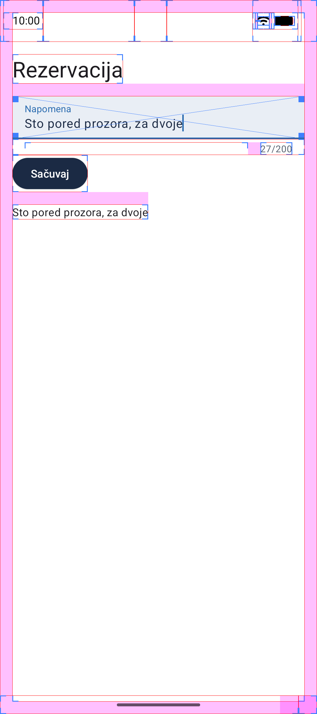
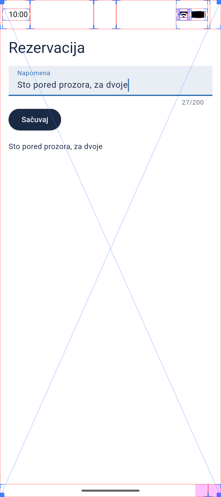

# Demo: granice rasporeda

Materijal za predmet **Razvoj multiplatformskih aplikacija** (Softversko inženjerstvo, IV godina, Računarski fakultet). Prati Predavanje 1, „Uvod u multiplatformski razvoj", deo „Pristupi", slajd „Demo: granice rasporeda".

Predavači: Luka Petrović (lpetrovic@raf.rs), Nikola Paunović (npaunovic@raf.rs).

Ista aplikacija u dva pristupa:

- `native_android`: nativni razvoj, Kotlin i sistemske komponente (View sistem).
- `flutter_app`: sopstveni rendering engine, Flutter crta ceo interfejs na platnu.

Sa uključenom opcijom za programere „Show layout bounds" vidi se razlika: nativno je svaki element zasebna sistemska komponenta, a Flutter je jedna površina preko celog ekrana.

  
  

## Pokretanje

- Nativna: otvori `native_android` u Android Studiju i pokreni, ili `cd native_android && ./gradlew installDebug` sa priključenim uređajem.
- Flutter: `cd flutter_app && flutter run`.

Za build iz terminala na novoj mašini napravi `native_android/local.properties` sa `sdk.dir=<putanja do Android SDK-a>` ili postavi `ANDROID_HOME`. Android Studio to radi sam pri otvaranju projekta.

## Show layout bounds

1. Settings → About phone → sedam puta tapni „Build number".
2. Settings → System → Developer options → sekcija Drawing → „Show layout bounds".

Isto preko adb-a: `adb shell setprop debug.layout true && adb shell service call activity 1599295570`

## Šta se vidi

U nativnoj aplikaciji svaki element ima svoj okvir jer je ekran stablo Android View-ova, a u Flutter aplikaciji postoji samo jedan okvir preko celog ekrana jer Flutter sam iscrtava ceo UI u jedan `FlutterView`. Snimci su u `screenshots/`.
